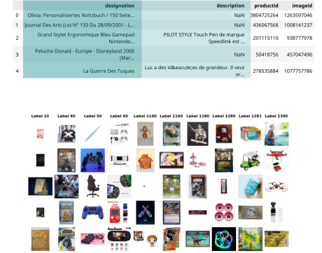
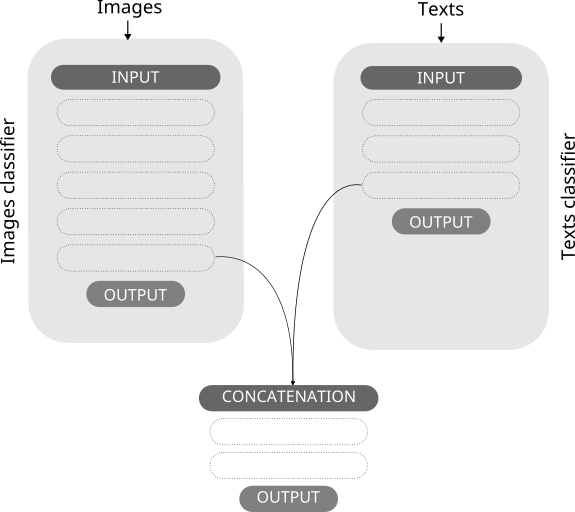

 
 


 
# DS - Bootcamp - DEC22 - Rakuten Challenge
 
## Presentation
This repository contains the code for project **Rakuten** based on data issued by [Rakuten Challenge](https://challengedata.ens.fr/participants/challenges/35/) 
and developed during [Data Scientist training](https://datascientest.com/en/data-scientist-course) at [DataScientest](https://datascientest.com/).  
  
The cataloging of product listings through title and image categorization is a fundamental problem for any e-commerce marketplace. The traditional way of categorizing is to do it manually. However, this takes up a lot of employees’ time and can be expensive.

The goal of this project is to **predict a product’s type code  through its description and image for the e-commerce platform Rakuten.** 

This project was developed by the following *team* :
- Charly LAGRESLE ([GitHub](https://github.com/karolus-git/) / [LinkedIn](https://www.linkedin.com/in/charly-lagresle/))
- Olga ([GitHub](https://github.com/data-modelisation/) / [LinkedIn](https://www.linkedin.com/in/tolstolutska/))
- Mohamed BACHKAT  ([GitHub](https://github.com/mbachkat/) / [LinkedIn](https://fr.linkedin.com/in/mo-bachkat-7389451a3/))

You can browse and run the [notebooks](./notebooks). You will need to install the dependencies (in a dedicated environment) :

```
pip install -r src/requirements.txt
```

You can also see a summary presentation of the project in the formats pdf 
[presentation.pdf](./slides/rapport.pdf) and pptx [presentation.pptx](./slides/rapport.pptx). 


## Application

The application has the following elements :
* *Frontend* that contains the web interface created with  application Streamlit  
* *Backend* that contains the API created with FastAPI   
* *Monitoring* that contains the application Tensorboard  

The application should be run within a Docker container [Streamlit + FastAPI + Docker = &hearts;].  
To run the Docker containers use the following command:

```sh
docker-compose up --build 
```
The app should then be available at [localhost:8501](http://localhost:8501) and API documentation should be available at [localhost:8111/docs](http://localhost:8111/docs).


## Overview
Rakuten Challenge contains : 

* `84 916` observations
* `27` categories to be determined 
* `0` duplicate data
* One color image per product
* Image size is `500x500px` in JPG format 

The sample of the data:   



The challenge presents several *interesting research aspects* due to :
- the intrinsic noisy nature of the product labels and images 
- the typical unbalanced data distribution
- the large size of the data 
- the description of the product in different languages 

We use a supervised approach for the one-label classification problem with an imbalanced distribution of labels. Therefore, the metric used in this challenge to rank the model's performance is the weighted-F1 score.

The development of the best model contains the following steps : 

1. Creation Text Classifier 
1. Creation Image Classifier 
1. Fusion Text Classifier and Image Classifier  

Text Classifier : 
* Contains text prepprocessing and text vectorization using Natural Language Processing (NLP).   
* Based on the *Neural_Embedder* text model. 

Image Classifier : 
* Bases on the *CNN* image model
* Use transfer learning with the *MobileNetV2* model loaded with pre-trained weights on *ImageNet*. 

The fusion model has the following architecture :  



The fusion model uses the image model to categorize products where the text model underperformed. The global **weighted-F1 score is 82.2%** and **all categories exceed the 55% score**. 

Model density analysis :   

