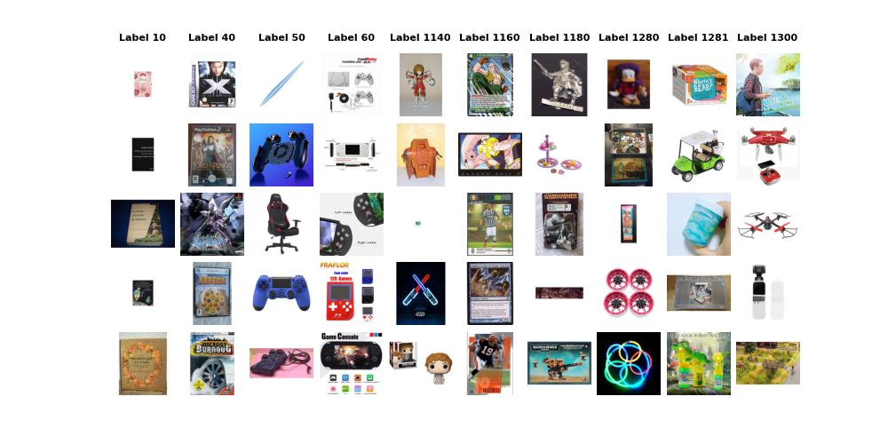
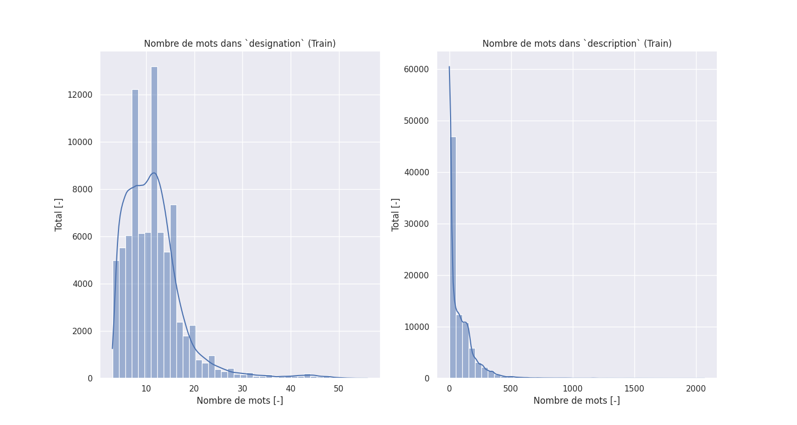
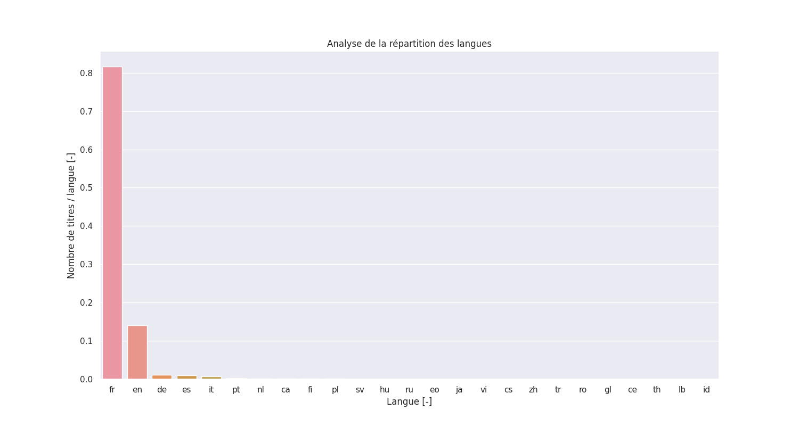
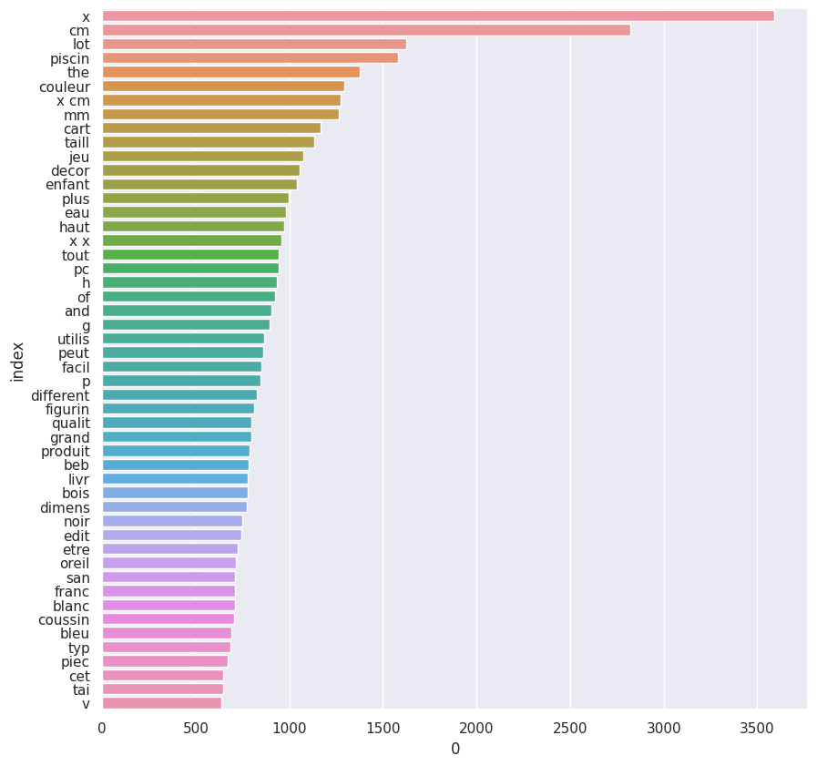
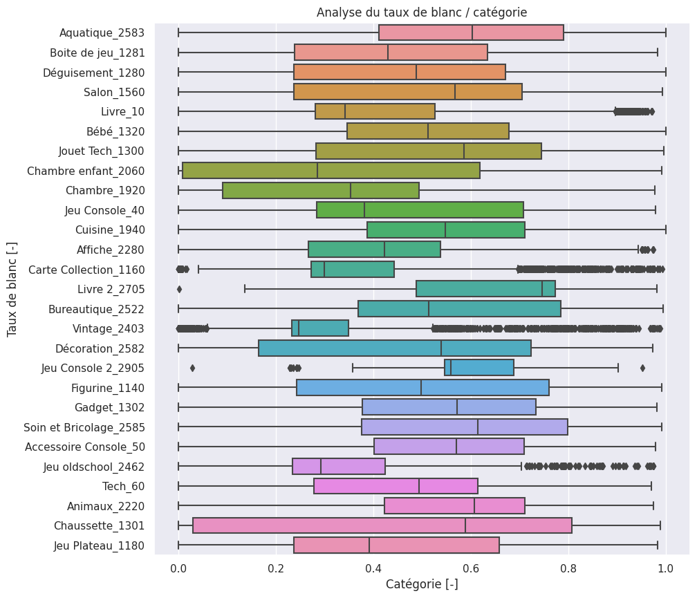
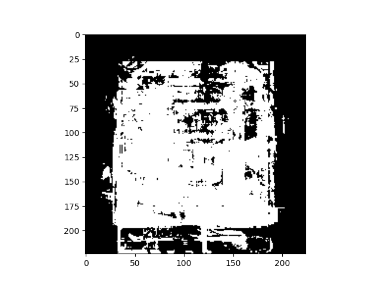
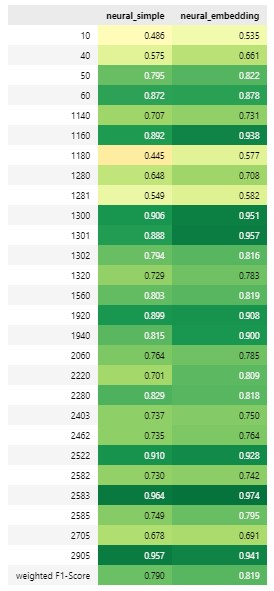
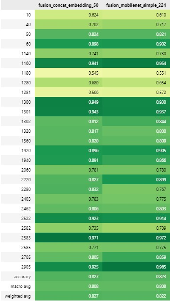
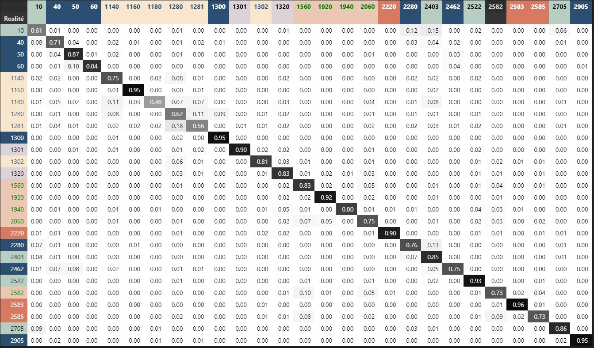
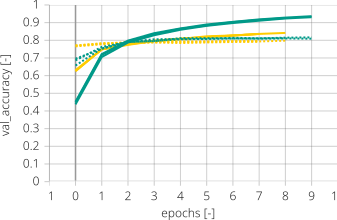

    
<!--
_class: 
    - lead
_paginate: false  
_footer: ''
_header: '' 
-->

 __Participants :__
Olga TOLSTOLUTSKA
Mohamed BACHKAT
Charly LAGRESLE

__Mentor :__ Manu POTREL
__Promotion:__ DST Bootcamp DEC22

___

<!--
_header: 'Context' 
-->

___

<!--
_header: 'Description des données' 
-->

* 27 variables cibles 
* 84 916 observations: `des données textuelles ainsi que des images`.
* Pas de duplications des données 
* Les données textuelles sont divisés en deux colonnes : `designation`   et `description`. Elles represent un titre du produit et sa decription. 
* Le titre du produit est composé de 4 à 54 mots
* La  description est plus longs et contient entre 0 (certaines descriptions sont vides) et 2 068 mots
* Images : couleur, `500x500px` encodées au format JPG 
___
<!--
_header: 'Description des données ' 
-->

|Cat. | Code et libellé|Cat.| Code et libellé|Cat.| Code et libellé|
|---:|------------|----:|------------|-------------------:|------------|
|    | 10 - Livre d'occasion   |  | 1300 - Jouet Tech     |   | 2280  - Affiche       |
|     | 40 - Jeu Console        |   | 1301 - Chaussette     |   | 2403 - Revue         |
|   |  50 -  Accessoire Console  |   | 1302 - Gadget         |  | 2462 - Jeu oldschool |
|    | 60 - Tech               |  | 1320 - Bébé           |    | 2522 - Bureautique   |
|    | 1140 -  Figurine          |   | 1560 - Salon          |   | 2582 - Décoration    |
|  |  1160 - Carte colllect.   |  | 1920 - Chambre        |  |  2583 - Aquatique     |
|   |  1180 - Jeu Plateau        |     | 1940 - Cuisine        |   | 2585 - Soin et Bricolage |
|    |  1280 - Déguisement        |    | 2060 - Chambre enfant |   | 2705 - Livre neuf    |     
|    | 1281 - Boite de jeu       |   | 2220 - Animaux        |   | 2905  - Jeu PC       |   

___
<!--
_header: 'Exploration des donnéess / Target' 
-->

___
<!--
_header: 'Exploration des donnéess / Text' 
-->

___
<!--
_header: 'Exploration des donnéess / Text' 
-->

___

<!--
_header: 'Exploration des donnéess / Images' 
-->

___
<!--
_header: 'Préparation des données / Text' 
-->

L'exemple de transformations appliquées : 
* `designation` : Une table très jolie! 
* `description` : <ul><li>\&#43;Dimensions : 60 x 33 cm</li><ul>

| Etape                                                 |     Résultat                                   | 
| :----- | :----------------------------------------------- | 
| Fusion de deux colonnes                               | Une table très jolie! <ul><li>\&#43;Dimensions : 60 x 33 cm</li></ul> | 
| Détection de la langue  et traduction en français        | Une table très jolie! <ul><li>\&#43;Dimensions : 60 x 33 cm</li></ul> | 
| Suppression les balises html                          | Une table très jolie! Dimensions : 60 x 33 cm  | 
| Suppression des caractères non alpha-numériques          | Une table très jolie Dimensions x cm           |
| Passage en minuscules                                  | une table très jolie dimensions x cm           |
| Supression des accènts                                              | une table tres jolie dimensions x cm           |
| Les mots d'un caractère                               | une table tres jolie dimensions cm             |
| Suppression des *stopwords*                           | table tres jolie dimensions cm                 | 
| Extraction de la racine des mots                      | tabl tres jol dimens cm                        | 
| Vectorisation du texte via un `Tokenizer`             | [6, 1, 2, 4, 5 ]                               | 
___

<!--
_header: 'Préparation des données / Images' 
-->
__Generateur d'image__:
* streaming per batch : les images sont transmises sous de batchs ce qui évite de traiter l'ensemble des données d'un coup
* rédimensionnement en taille `224x224 px`
* application de la fonctionne `preprocess_input` spécifique pour chaque modèle 

___
<!--
_header: 'Les modèles / Deep learning / Text ' 
-->

___
<!--
_header: 'Les modèles / Deep learning / Image ' 
-->

___
<!--
_header: 'Les modèles / Deep learning / Fusion ' 
-->

Un schéma simplifié du fonctionnement de concaténation.

* concaténation est faite sur les avant-dernières couches de deux modèles. 
* les autres couches sont *freezées*. 
* couches denses completent la fusion pour obtenir une classification sur 27 classes. 
___
<!--
_header: 'Les modèles / Deep learning / Fusion ' 
-->

___
<!--
_header: 'Analyse du meilleur modèle' 
-->

Pas d'impacte sur les performances réduites du modèle d'image.
  * Toutes les catégories dépassent le score de 54% et 
  * Une catégorie sur trois dépasse le score de 90%

Le modèle concaténé s'aide du modèle d'image pour catégoriser les produits où le modèle de texte sous-performait : 
  * La catégorie 1080 (Jeu Plateau) gagne 25 points
  * La catégorie 2705 (Livre neuf) gagne 23 points
___

<!--
_header: 'Limites' 
-->
* Le traitement des 84916 images nécessite d'utilisation de générateurs.
* Disponibilité limité de ressources de calcul de type GPU ou TPU via Google Colab. 
* Coupures de lien entre Google Drive et Google Colab ont entraîné une grande perte de temps 
* La création d'un modèle de fusion a été une tâche ardue, principalement pour la gestion des entrées sous forme de générateurs.

___
<!--
_header: 'Perspectives' 
-->
 

Nous continuons de croire que le monde numérique a le potentiel d'améliorer la vie de chacun d'entre nous. Oubliez la peur. Adoptez l'optimisme.
 
 ***Hiroshi Mikitani** – Fondateur et CEO de Rakuten*

----
<!--
_header: 'Perspectives' 
-->

###### Les modifications globaux : 
* Uniformisation des données dans le code. Actuellement, des dataframes Pandas, des tableaux Numpy, des générateurs d'images fonctionnent ensemble. Tout pourrait être géré autour d'un seul type de données, comme les tf.data.DataSet.

###### Le modèle de texte: 
- une couche d'embedding pré-entrainée, par exemple celle issue de CamemBERT. 
 
 

----
<!--
_header: 'Perspectives' 
-->

###### Le modèle d'image :
- évolution traitement et preprocessing des images  
  * croping d'image 
  * augmentation des données via transformation 
- évolution de modèles testés : 
    * implimenter _Batch Normalization_,
    * entraîner des couches de model issue de transfer learning  
    * configurer differement les hyperparamétres 
    * entraînement des couches de model issue de transfer learning 
- analyse de patterns generés par les couches 
- test autres modèles avec autre taille des images en entrés 

###### Fusion 
- ajout d'autres modèles au modèle de fusion
- test un autre approche de la fusion :  utiliser un modèle pour identifier un group global et ensuite sous-group precis. Par exemple premiere model prédit un group "Livre" et deuxieme model predit "Nouveau" ou "Ancien".

___
<!--
_header: '' 
-->
Le projet  a été très intéressant, car complexe et faisant appel à des notions avancées mêlant le traitement de textes et le traitement d'images. 

L'exploration de données, le travail de groupe, les différentes implémentations et sprints ont fait de ce projet un projet répondant, nous l'espérons, aux besoins d'une entreprise.

---
<!--
_header: 'Annexe : Machine Learning  / Text' 
-->
* Catégorie `10` (Livre d'occasion) souvent confondue avec `2705` (Livre neuf) et `2403` (Revue) 
* Catégorie `40` (Jeu console) souvent confondue avec `10` (Livre occasion)  et `2462` (Jeu oldschool)
* Catégorie `1280` (Déguisement) souvent confondue avec `1281` (Boîte de jeu) et `1140` (Figurine)

___
<!--
_header: 'Annexe : Machine Learning / Image' 
-->
# Machine Learning / Image
| Classifier | Acc. | Precision weighted | Recall weighted | F1 weighted |
|------------|----------|--------------------|-----------------|-------------|
| LogReg     | 0.18     | 0.16               | 0.18            | 0.16        |
| RF         | 0.12     | 0.04               | 0.12            | 0.04        |
| KNN        | 0.18     | 0.16               | 0.18            | 0.16        |
| SVC        | 0.18     | 0.17               | 0.18            | 0.17        |
| GradBoost  | 0.09     | 0.08               | 0.09            | 0.06        |

___
<!--
_header: 'Annexe : Les modèles / Deep learning / Text ' 
-->

___
<!--
_header: 'Annexe : Les modèles / Deep learning / Image ' 
-->
 |Model                        |Accuracy                 | Val accuracy    | 
|-----------------------------|-------------------------|-----------------|
| VGG16                       |0.50                     |0.49             | 
| ResNet                      |0.16                     |0.18             | 
| MobileNet                   |0.87                     |0.47             |

