    
<!--
_class: 
    - lead
_paginate: false  
_footer: ''
_header: '' 
-->

 

__Participants :__
Olga TOLSTOLUTSKA
Mohamed BACHKAT
Charly LAGRESLE

__Mentor :__ Manu POTREL
__Promotion:__ DST Bootcamp DEC22

___

<!--
_header: 'Contexte' 
-->

* Site de e-commerce avec 1.3 milliards d'utilisateurs
* Suggestions de recherche et recommandations pour l'utilisateur
* Classification des produits nécessaire
* Manuellement impossible

### Objectifs

Prédire la **catégorie d'un produit** sur la base de son `titre`, sa `description` et de son `image`

_1 + 1 = 3_ ... Un **modèle de texte**, un **modèle d'image** et un **modèle de fusion** 

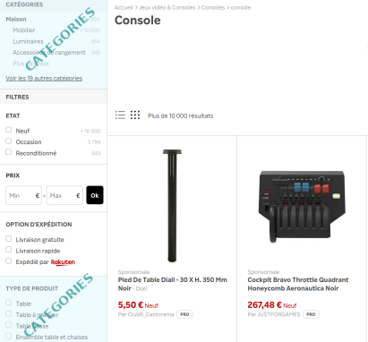
___

<!--
_header: 'Présentation des données' 
-->

### En chiffres
* **84 916** observations
* **27** catégories à déterminer 
* **0** donnée dupliquée

### Texte
  * Un produit est désigné par : `designation`   et `description` soit un titre et sa description
  * 35% de NaNs pour `description`

### Image
  * Une image couleur par produit
  * Peut comporter un support ou une mise en scène
  * Taille `500x500px` en JPG

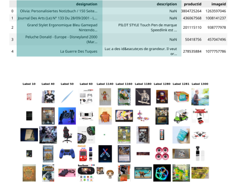
___
<!--
_header: 'Exploration des données / Cibles' 
-->

### Données déséquilibrées
* 27 catégories (codes fournis)
* 7 domaines différents trouvés (non labelisés, non utilisés)
* Sur-représentation de la classe `2583`
* Sous-représentation des classes `60`, `1320` et `2220`

### Challenge probable
&rarr; Les modèles auront probablement (comme nous) du mal à distinguer les catégories de produits appartenant même domaine

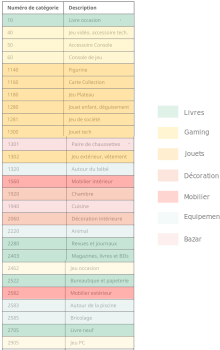

___
<!--
_header: 'Exploration des données / Textes' 
-->

### Nombres de mots
* Variable (rappel : 35% de `description` comporte des NaNs)
* Limite à 500 mots

### Langues
* Détection de la langue pour traduction à effectuer
  * 81% français
  * 14% anglais et autres langues

### Fréquences des mots
* Grande disparité d'apparition
* Quelques domaines/catégories apparaissent :
  * Dimensions (`cm`, `x`, `mm`, `taill`, `lot`)
  * Autour de la piscine (`eau`, `piscin`)

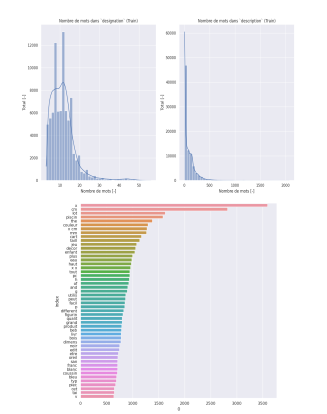

___

<!--
_header: 'Exploration des données / Images' 
-->

### Analyse de canaux
* Fortes disparités dans le taux de blanc de images
  * Catégorie `1301` très étendue
  * Catégorie `2403`, `1160` et `2462` plus restreintes
  * Nombreux *outliers* pour `2403` et `1160` 

### Analayse de la variance
* Masque de variance très net sur les bordures des images
* Possibilité de rogner les images de 20% sans trop de perte de données

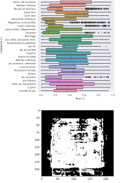
___
<!--
_header: 'Préparation des données / Textes' 
-->

L'exemple de transformations appliquées : 
* colonne `designation` : `Une table très jolie!` 
* colonne `description` : `<ul><li>\&#43;Dimensions : 60 x 33 cm</li><ul>`

| Étape                                                 |     Résultat                                   | 
| :----- | :----------------------------------------------- | 
| Fusion de `description` et `designation` | `Une table très jolie! <ul><li>\&#43;Dimensions : 60 x 33 cm</li></ul>` | 
| Détection de la langue  et traduction en français        | `Une table très jolie! <ul><li>\&#43;Dimensions : 60 x 33 cm</li></ul>` | 
| Suppression les balises html                          | `Une table très jolie! Dimensions : 60 x 33 cm`  | 
| Suppression des caractères numériques          | `Une table très jolie Dimensions x cm`           |
| Passage en minuscules                                  | `une table très jolie dimensions x cm`           |
| Suppression des accents                                              | `une table tres jolie dimensions x cm`           |
| Suppression des mots d'un caractère                               | `une table tres jolie dimensions cm`             |
| Suppression des *stopwords*                           | `table tres jolie dimensions cm`                 | 
| Extraction de la racine des mots                      | `tabl tres jol dimens cm`                        | 
| Vectorisation TF-IDF du texte via un `Tokenizer`             | [.0.06, 0.001, 0, 0.4, 0.555, ... ]                               | 
___

<!--
_header: 'Préparation des données / Images' 
-->
__Générateur d'images__:
* Streaming per *batch* : images transmises forme de *batchs* ce qui évite de traiter l'ensemble des données (limite RAM + CPU)
* Rognage des images de 20%
* Redimensionnement en taille `224x224 px`
* Application de la fonction `preprocess_input` spécifique à chaque modèle de *deep-learning*

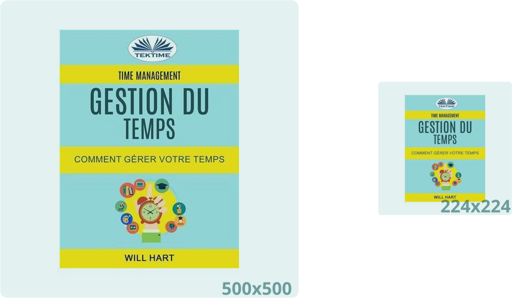
___
<!--
_header: 'Deep learning / Text ' 
-->

  <h2>Modèle Texte</h2>
  <ul>
    <li> Couche de TextVectorization
    <li> Embedding
    <li> Couches denses + Dropout
  </ul>

  <h2>Modèle Image</h2>
    <ul>
    <li> Couche de TextVectorization
    <li> Embedding
    <li> Couches denses + Dropout
  </ul>

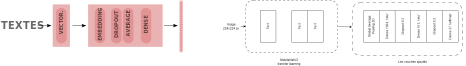

___
<!--
_header: 'Deep learning / Image ' 
-->
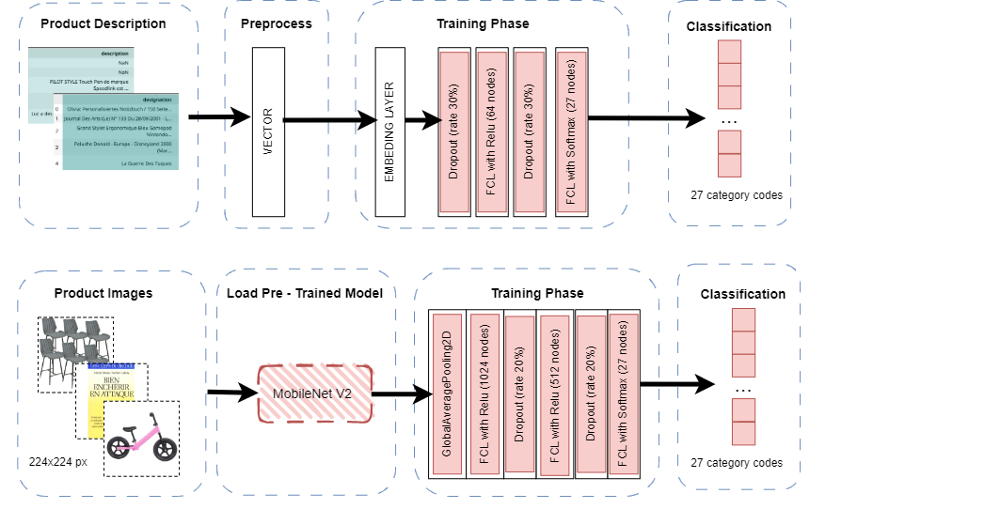
___
<!--
_header: 'Deep learning / Fusion ' 
-->

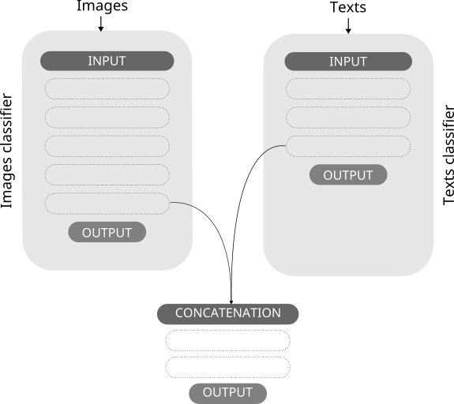
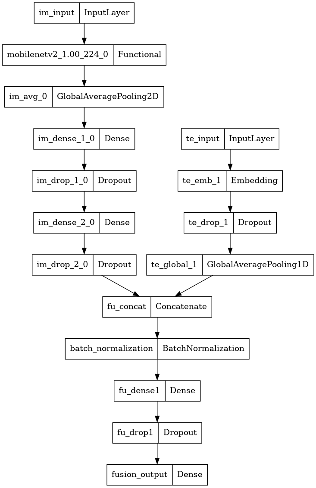

Un schéma simplifié du fonctionnement de concaténation.

* La concaténation est faite sur les avant-dernières couches de deux modèles. 
* Les autres couches des modèles sont *freezées*. 
* Une couche de *BatchNormalization*
* Deux couches denses complètent la fusion pour obtenir une classification sur 27 classes. 

___
<!--
_header: 'Analyse du meilleur modèle 1/2' 
-->

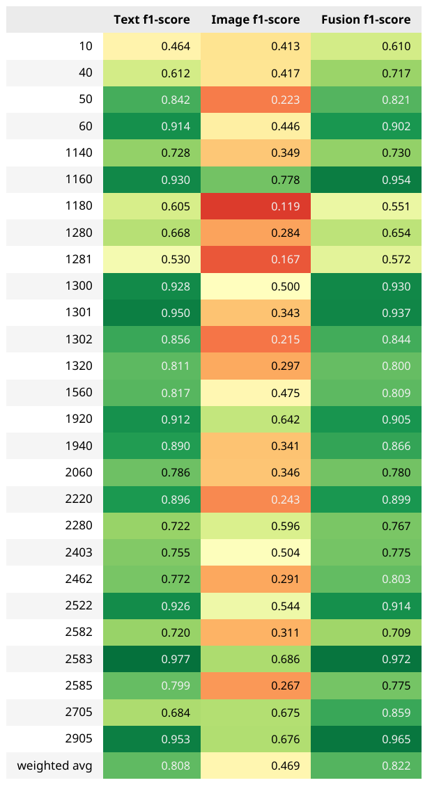

### Analyse des *weigthed f1-scores*
 
  * Toutes les catégories dépassent le score de 55%
  * Une catégorie sur trois dépasse le score de 90%
  * Au final : *weighted f1-score* 82.2 %

  Le modèle concaténé s'aide du modèle d'image pour catégoriser les produits où le modèle de texte sous-performait : 
  * Les catégories `10` et `2705`  sont très impactées par la fusion
    * La catégorie `10` Livre neuf gagne 15 points
    * La catégorie `2705` Livre occasion gagne 18 points
___
<!--
_header: 'Analyse du meilleur modèle 2/2' 
-->

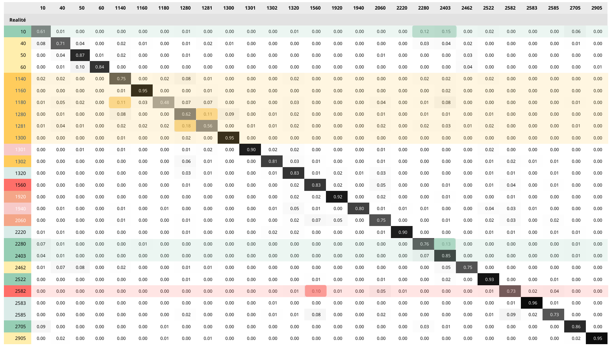

### Analyse des erreurs > 10%
* Livres : `10`, `2080`, `2403` et `2280`
* Jouets : `1080`, `1280` et `1281`
* Mobilier: `2582` et `1560`

Nous nous attendions à avoir des erreurs au sein de produits du même domaine.
___

<!--
_header: 'Challenges' 
-->

### Informations complémentaires
* Pourquoi ces produits et ces catégories à classer en particulier?
* Comment la classification initiale des targets a-t-elle été faite?

### Ressources et techniques
* Disponibilité limitée de ressources de calcul de type GPU ou TPU via Google Colab. 
* Pertes d'accès fréquentes entre Google Drive et Google Colab, perte de temps
* Arrivées tardives des notions de générateurs et de deep-learning dans les modules

----
<!--
_header: 'Perspectives' 
-->

###### Le modèle de textes: 
- Utiliser des modèles pré-entrainés
  - Word2Vec
  - CamemBERT

###### Le modèle d'images :
- Étapes de pré-processing  
  * Augmentation des données via transformations
- Modèles
    * Implémenter *Batch Normalization*
    * Entraîner des couches de modèles issues de *transfer-learning* 
    * Configurer différemment les hyperparamètres 
    * Tester les *Vision Transformers*

###### Globalement 
- Ajouter d'autes modèles, plus performants sur les classes délicates à prédire
- Analyse de patterns générés par les couches CNN
- Travailler sur l'interprétabilité des résultats

___
<!--
_header: 'Conclusion' 
-->
Merci à tous pour ces 3 mois très intenses et riches ! 
 
[Streamlit + FastAPI + Docker = &hearts;](localhost:8080).
 

Nous continuons de croire que le monde numérique a le potentiel d'améliorer la vie de chacun d'entre nous. Oubliez la peur. Adoptez l'optimisme.
 
 ***Hiroshi Mikitani** – Fondateur et CEO de Rakuten*

___

___
<!--
_header: 'Choix de la métrique' 
-->

### Notions
* Connaissance du métier : une erreur de classification n'est pas fatale
* Labelisation : comment a-t-elle été effectuée
* Jeu de données déséquilibré : dû à une survente ou à des difficultés à classer ces produits
* Forte tendance à l'*overfitting*

**&rarr;** Choix de la métrique : *f1 weigthed score* pour un bon équilibre entre *accuracy* et *recall*

### Remarques

* Modèle aléatoire : score de 3.7% en moyenne
* Une métrique personnalisée aurait pu être créée

___
<!--
_header: 'Callbacks' 
-->

### Nécessaires au contrôle des modèles lors de l'apprentissage
* Suivi via *TensorBoard*
* **EarlyStopping** : met fin à l'apprentissage si val_loss augmente pendant plus de 5 périodes à partir de la 8ème période
* **ReduceLROnPlateau** : réduit le taux d'apprentissage si val_loss stagne sur un plateau pendant plus de 5 périodes

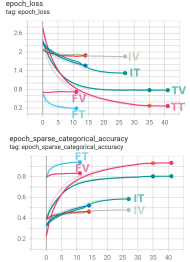

___
<!--
_header: 'Annexe Exploration des données / Target' 
-->

### Déséquilibre des targets
* Non homogéneité de la répartition des classes
* Environ 7 classes sur-représentées
* 3 classes sous-représentées

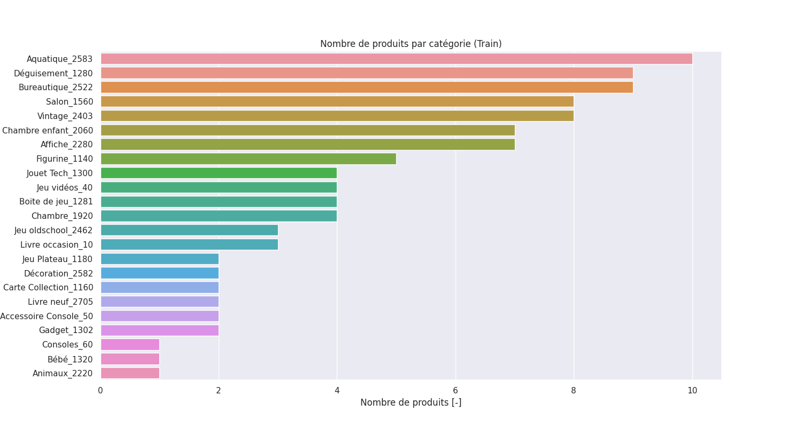

___
<!--
_header: 'Annexe : Machine Learning  / Text' 
-->
* Catégorie `10` (Livre d'occasion) souvent confondue avec `2705` (Livre neuf) et `2403` (Revue) 
* Catégorie `40` (Jeu console) souvent confondue avec `10` (Livre occasion)  et `2462` (Jeu oldschool)
* Catégorie `1280` (Déguisement) souvent confondue avec `1281` (Boîte de jeu) et `1140` (Figurine)

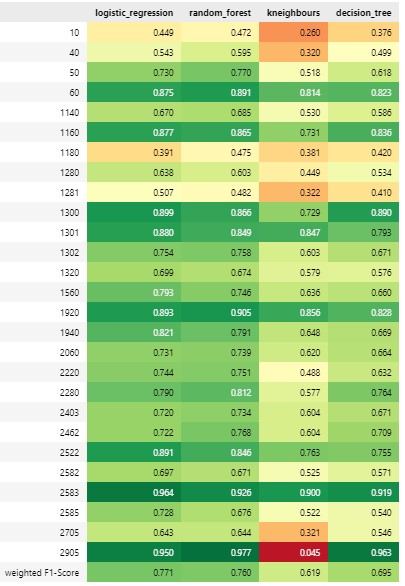

___
<!--
_header: 'Machine Learning / Image' 
-->
# Machine Learning / Image
| Classifier | Acc. | Precision weighted | Recall weighted | F1 weighted |
|------------|----------|--------------------|-----------------|-------------|
| LogReg     | 0.18     | 0.16               | 0.18            | 0.16        |
| RF         | 0.12     | 0.04               | 0.12            | 0.04        |
| KNN        | 0.18     | 0.16               | 0.18            | 0.16        |
| SVC        | 0.18     | 0.17               | 0.18            | 0.17        |
| GradBoost  | 0.09     | 0.08               | 0.09            | 0.06        |

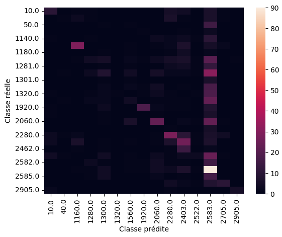
___

<!--
_header: 'Les modèles / Deep learning / Image ' 
-->
 |Model                        |Accuracy                 | Val accuracy    | 
|-----------------------------|-------------------------|-----------------|
| VGG16                       |0.50                     |0.49             | 
| ResNet                      |0.16                     |0.18             | 
| MobileNet                   |0.87                     |0.47             |

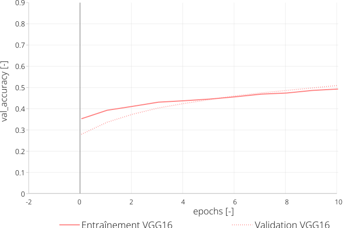

