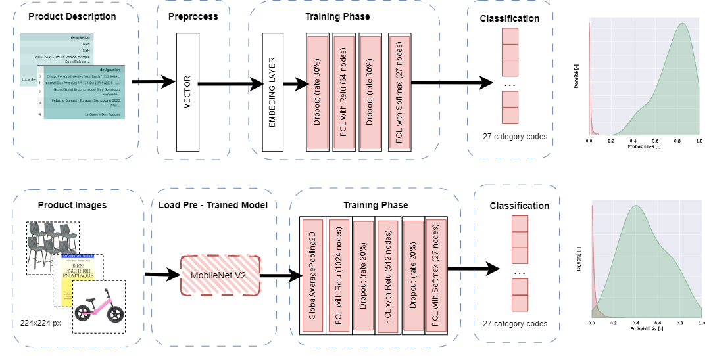

    
<!--
_class: 
    - lead
_paginate: false  
_footer: ''
_header: '' 
-->

 

__Participants :__
Olga TOLSTOLUTSKA
Mohamed BACHKAT
Charly LAGRESLE

__Mentor :__ Manu POTREL
__Promotion:__ DST Bootcamp DEC22

___

<!--
_header: 'Contexte' 
-->

## Rakuten

* Site de e-commerce avec 1.3 milliards d'utilisateurs
* Suggestions de recherche et recommandations pour l'utilisateur
* Classification des produits nécessaire
* Manuellement impossible

## Objectifs

Prédire la catégorie d'un produit sur la base de son **titre**, sa **description** et de son **image**

1 + 1 = 3 ... Un **modèle de texte**, un **modèle d'image** et un **modèle de fusion** 

___

<!--
_header: 'Présentation des données' 
-->

* **84 916** observations
* **27** catégories à déterminer 
* **0** donnée dupliquée
 
* **Textes** 
  * Un produit est désigné par : `designation`   et `description` soit un titre et sa description
  * 35% de NaNs pour `description`
 
* **Images**
  * Une image couleur par produit
  * Peut comporter un support ou une mise en scène
  * Taille `500x500px` en JPG

___
<!--
_header: 'Exploration des données | Cibles' 
-->

## Données déséquilibrées
* 27 catégories (codes fournis)
* 7 domaines différents trouvés (non labelisés, non utilisés)
* Sur-représentation de la classe `2583`
* Sous-représentation des classe `60`, `1320` et `2220`

## Challenge probable
&rarr; Les modèles auront probablement (comme nous) du mal à distinguer les catégories de produits du même domaine

___
<!--
_header: 'Exploration des données / Textes' 
-->

## Extraction de données quantitives
* Nombre de mots très variable

## Langues
* Détection de la langue
  * 81% français
  * 14% anglais
  * Traduction

___

<!--
_header: 'Exploration des données / Images' 
-->

## Analyse de canaux
* TODO

## Analayse de la variance
* Masque de variance très net sur les bordures des images
* Possibilité de rogner les images de 20% sans perdre trop d'information

___
<!--
_header: 'Préparation des données / Textes' 
-->

L'exemple de transformations appliquées : 
* colonne `designation` : `Une table très jolie!` 
* colonne `description` : `<ul><li>\&#43;Dimensions : 60 x 33 cm</li><ul>`

| Étape                                                 |     Résultat                                   | 
| :----- | :----------------------------------------------- | 
| Fusion de `description` et `designation` | Une table très jolie! <ul><li>\&#43;Dimensions : 60 x 33 cm</li></ul> | 
| Détection de la langue  et traduction en français        | Une table très jolie! <ul><li>\&#43;Dimensions : 60 x 33 cm</li></ul> | 
| Suppression les balises html                          | Une table très jolie! Dimensions : 60 x 33 cm  | 
| Suppression des caractères non alpha-numériques          | Une table très jolie Dimensions x cm           |
| Passage en minuscules                                  | une table très jolie dimensions x cm           |
| Suppression des accents                                              | une table tres jolie dimensions x cm           |
| Suppression des mots d'un caractère                               | une table tres jolie dimensions cm             |
| Suppression des *stopwords*                           | table tres jolie dimensions cm                 | 
| Extraction de la racine des mots                      | tabl tres jol dimens cm                        | 
| Vectorisation TF-IDF du texte via un `Tokenizer`             | [6, 1, 2, 4, 5 ]                               | 
___

<!--
_header: 'Préparation des données / Images' 
-->
__Générateur d'images__:
* Streaming per *batch* : images transmises forme de *batchs* ce qui évite de traiter l'ensemble des données d'un coup
* Rognage des images de 20%
* Redimensionnement en taille `224x224 px`
* Application de la fonction `preprocess_input` spécifique à chaque modèle de *deep-learning*

___
<!--
_header: 'Les modèles / Deep learning / Text ' 
-->

___
<!--
_header: 'Les modèles / Deep learning / Image ' 
-->

___
<!--
_header: 'Les modèles / Deep learning / Fusion ' 
-->

Un schéma simplifié du fonctionnement de concaténation.

<<<<<<< HEAD
* concaténation est faite sur les avant-dernières couches de deux modèles. 
* les autres couches sont *freezées*. 
* couches denses completent la fusion pour obtenir une classification sur 27 classes. 
___
<!--
_header: 'Les modèles / Deep learning / Fusion ' 
-->

||||||| 24a01b1
* concaténation est faite sur les avant-dernières couches de deux modèles. 
* les autres couches sont *freezées*. 
* couches denses completent la fusion pour obtenir une classification sur 27 classes. 
___
<!--
_header: 'Les modèles / Deep learning / Fusion ' 
-->

=======
* La concaténation est faite sur les avant-dernières couches de deux modèles. 
* Les autres couches des modèles sont *freezées*. 
* Une couche de *BatchNormalization*
* Deux couches denses complètent la fusion pour obtenir une classification sur 27 classes. 
>>>>>>> dev_slides_cla

___
<!--
_header: 'Analyse du meilleur modèle 1/2' 
-->

## Analyse des *weigthed f1-scores*
 
  * Toutes les catégories dépassent le score de 55%
  * Une catégorie sur trois dépasse le score de 90%
  * Au final : *weighted f1-score* 82.2 %

  Le modèle concaténé s'aide du modèle d'image pour catégoriser les produits où le modèle de texte sous-performait : 
  * Les catégories `10` et `2705`  sont très impactées par la fusion
    * La catégorie `10` Livre neuf gagne 15 points
    * La catégorie `2705` Livre occasion gagne 18 points
___
<!--
_header: 'Analyse du meilleur modèle 2/2' 
-->

## Analyse des erreurs > 10%
* Livres : `10`, `2080`, `2403` et `2280`
* Jouets : `1080`, `1280` et `1281`
* Mobilier: `2582` et `1560`

Nous nous attendions à avoir des erreurs au sein de produits du même domaine
___

<!--
_header: 'Challenges' 
-->

## Informations oomplémentaires
* Pourquoi ces produits et ces catégories à classer en particulier?
* Comment la classification initiale des targets a-t-elle été faite?

## Ressources et techniques
* Disponibilité limitée de ressources de calcul de type GPU ou TPU via Google Colab. 
* Pertes d'accès fréquentes entre Google Drive et Google Colab, perte de temps
* Arrivées tardives des notions de générateurs et de deep-learning dans les modules

----
<!--
_header: 'Perspectives' 
-->

###### Le modèle de texte: 
- une couche d'embedding pré-entrainée, par exemple celle issue de CamemBERT. 

###### Le modèle d'image :
- évolution traitement et preprocessing des images  
  * croping d'image 
  * augmentation des données via transformation 
- évolution de modèles testés : 
    * implimenter _Batch Normalization_,
    * entraîner des couches de model issue de transfer learning  
    * configurer differement les hyperparamétres 
    * entraînement des couches de model issue de transfer learning 
- analyse de patterns generés par les couches 
- test autres modèles avec autre taille des images en entrés 

###### Fusion 
- ajout d'autres modèles au modèle de fusion
- test un autre approche de la fusion :  utiliser un modèle pour identifier un group global et ensuite sous-group precis. Par exemple premiere model prédit un group "Livre" et deuxieme model predit "Nouveau" ou "Ancien".

___
<!--
_header: 'Conclusion' 
-->
 
 Merci à tous pour ces 3 mois très intenses et riches ! 

[Lien vers le Streamlit](localhost:8080)

Nous continuons de croire que le monde numérique a le potentiel d'améliorer la vie de chacun d'entre nous. Oubliez la peur. Adoptez l'optimisme.
 
 ***Hiroshi Mikitani** – Fondateur et CEO de Rakuten*

___

___
<!--
_header: 'Annexe | Choix de la métrique' 
-->

## Notions
* Connaissance du métier : une erreur de classification n'est pas fatale
* Labelisation : comment a-t-elle été effectuée
* Jeu de données déséquilibré : dû à une survente ou à des difficultés à classer ces produits
* Forte tendance à l'*overfitting*

**&rarr;** Choix de la métrique : *f1 weigthed score* pour un bon équilibre entre *accuracy* et *recall*

## Remarques

* Modèle aléatoire : score de 3.7% en moyenne
* Une métrique personnalisée aurait pu être créée

___
<!--
_header: 'Annexe | Callbacks' 
-->

## Nécessaires au contrôle des modèles lors de l'apprentissage
* Suivi via *TensorBoard*
* **EarlyStopping** : met fin à l'apprentissage si val_loss augmente pendant plus de 5 périodes à partir de la 8ème période
* **ReduceLROnPlateau** : réduit le taux d'apprentissage si val_loss stagne sur un plateau pendant plus de 5 périodes

___
<!--
_header: 'Annexe Exploration des données / Target' 
-->

## Déséquilibre des targets
* Non homogéneité de la répartition des classes
* Environ 7 classes sur-représentées
* 3 classes sous-représentées

___
<!--
_header: 'Annexe : Machine Learning  / Text' 
-->
* Catégorie `10` (Livre d'occasion) souvent confondue avec `2705` (Livre neuf) et `2403` (Revue) 
* Catégorie `40` (Jeu console) souvent confondue avec `10` (Livre occasion)  et `2462` (Jeu oldschool)
* Catégorie `1280` (Déguisement) souvent confondue avec `1281` (Boîte de jeu) et `1140` (Figurine)

___
<!--
_header: 'Annexe : Machine Learning / Image' 
-->
# Machine Learning / Image
| Classifier | Acc. | Precision weighted | Recall weighted | F1 weighted |
|------------|----------|--------------------|-----------------|-------------|
| LogReg     | 0.18     | 0.16               | 0.18            | 0.16        |
| RF         | 0.12     | 0.04               | 0.12            | 0.04        |
| KNN        | 0.18     | 0.16               | 0.18            | 0.16        |
| SVC        | 0.18     | 0.17               | 0.18            | 0.17        |
| GradBoost  | 0.09     | 0.08               | 0.09            | 0.06        |

___

<!--
_header: 'Annexe : Les modèles / Deep learning / Image ' 
-->
 |Model                        |Accuracy                 | Val accuracy    | 
|-----------------------------|-------------------------|-----------------|
| VGG16                       |0.50                     |0.49             | 
| ResNet                      |0.16                     |0.18             | 
| MobileNet                   |0.87                     |0.47             |

