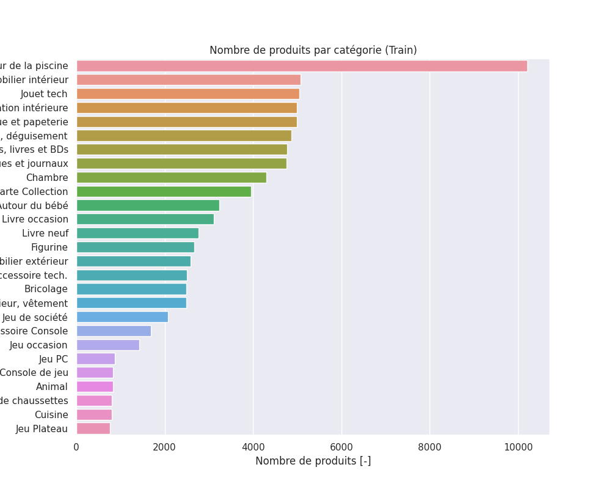
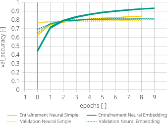

    
<!--
_class: 
    - lead
_paginate: false  
_footer: ''
_header: '' 
-->

 __Participants :__
Olga TOLSTOLUTSKA
Mohamed BACHKAT
Charly LAGRESLE

__Mentor :__ Manu POTREL
__Promotion:__ DST Bootcamp DEC22

___

<!--
_header: 'Context' 
-->

___

<!--
_header: 'Description des données' 
-->

* 27 variables cibles 
* 84 916 observations: `des données textuelles ainsi que des images`.
* Pas de duplications des données 
* Les données textuelles sont divisés en deux colonnes : `designation`   et `description`. Elles represent un titre du produit et sa decription. 
* Le titre du produit est composé de 4 à 54 mots
* La  description est plus longs et contient entre 0 (certaines descriptions sont vides) et 2 068 mots
* Images : couleur, `500x500px` encodées au format JPG 

---
<!--
_header: 'Description des données / Nombre de produits par catégorie' 
-->

___

<!--
_header: 'Description des données /Les catégories et leurs descriptions' 
-->

|Catégorie | Description|Catégorie| Description|Catégorie| Description|
|---:|------------|----:|------------|-------------------:|------------|
| 10 | Livre d'occasion   | 1301 | Chaussette | 2462 | Jeu oldschool |
| 40 | Jeu Console        | 1302 | Gadget     | 2522 | Bureautique |
| 50 | Accessoire Console | 1320 | Bébé       | 2582 | Décoration |
| 60 | Tech               | 1560 | Salon      | 2583 | Aquatique |
| 1140 | Figurine         | 1920 | Chambre    |2585 | Soin et Bricolage |
| 1160 | Carte Collection | 1940 | Cuisine    | 2705 | Livre neuf |
| 1180 | Jeu Plateau      | 2060 | Chambre enfant | 2905 | Jeu PC |
| 1280 | Déguisement      | 2220 | Animaux    | | |
| 1281 | Boite de jeu     | 2280 | Affiche    | | |
| 1300 | Jouet Tech       | 2403 | Revue    | | |

___
<!--
_header: 'Exploration des donnéess / Target' 
-->

___
<!--
_header: 'Exploration des donnéess / Text' 
-->

___
<!--
_header: 'Exploration des donnéess / Text' 
-->

___

<!--
_header: 'Exploration des donnéess / Images' 
-->

___
<!--
_header: 'Préparation des données / Text' 
-->

L'exemple de transformations appliquées : 
* `designation` : Une table très jolie! 
* `description` : <ul><li>\&#43;Dimensions : 60 x 33 cm</li>

| Etape                                                 |     Résultat                                   | 
| :----- | :----------------------------------------------- | 
| Fusion de deux colonnes                               | Une table très jolie! <ul><li>\&#43;Dimensions : 60 x 33 cm</li> | 
| Détection la langue  et traduction en français        | Une table très jolie! <ul><li>\&#43;Dimensions : 60 x 33 cm</li> | 
| Suppression les balises html                          | Une table très jolie! Dimensions : 60 x 33 cm  | 
| Suppression des caractères non alphanumériques          | Une table très jolie Dimensions x cm           |
| Passage en minuscule                                  | une table très jolie dimensions x cm           |
| Encodage                                              | une table tres jolie dimensions x cm           |
| Les mots d'un caractère                               | une table tres jolie dimensions cm             |
| Suppression des *stopwords*                           | table tres jolie dimensions cm                 | 
| Extraction de la racine des mots                      | tabl tres jol dimens cm                        | 
| Vectorisation du texte via un `Tokenizer`             | [6, 1, 2, 4, 5 ]                               | 
___

<!--
_header: 'Préparation des données / Images' 
-->
__ImageDataGenerator__:
* streaming per batch : les images sont transmises sous de batchs ce qui évite de traiter l'ensemble des données d'un coup
* augmentation de données via les transformation appliqués 
* rédimensionnement en taille 224x224
* application de la fonctionne `preprocess_input` spécifique pour chaque modèle 

___
<!--
_header: 'Les modèles / Deep learning / Text ' 
-->

___
<!--
_header: 'Les modèles / Deep learning / Fusion ' 
-->

Explication de fusion ....
___
<!--
_header: 'Les modèles / Deep learning / Fusion ' 
-->

___
<!--
_header: 'Analyse du meilleur modèle' 
-->
Pas d'impacte sur les performances réduites du modèle d'image.
  * Toutes les catégories dépassent le score de 54% et 
  * Une catégorie sur trois dépasse le score de 90%

Le modèle concaténé s'aide du modèle d'image pour catégoriser les produits où le modèle de texte sous-performait : 
  * La catégorie 1080 (Jeu Plateau) gagne 25 points
  * La catégorie 2705 (Livre neuf) gagne 23 points

___
<!--
_header: 'Limites' 
-->
Le projet est un projet mêlant de l'analyse de texte et du traitement d'images : des notions poussées de deep-learning sont nécessaires à la compréhension et l'implémentation de telles techniques.
De nombreux limites sont apparus tout au long de ce projet :

* L'accès à des ressources de calcul de type GPU ou TPU nous a été quasi impossible, notamment via Google Collab. 
* L'accès aux 84 916 images, stockées dans un Google Drive et nécessaires à l'entraînement du modèle d'images, était érattique : de nombreuses coupures de ce lien entre Google Drive et Google Collab ont entraîné ici aussi une grande perte de temps et une grande frustration.
* Le traitement des 84916 images nécessite d'utilisation de générateurs. Ces derniers sont à customiser manuellement afin de permettre une gestion en batch des données textuelles et d'images pour le modèle de fusion.
* La création d'un modèle de fusion a été une tâche ardue, principalement pour la gestion des entrées sous forme de générateurs.

___
<!--
_header: 'Perspectives' 
-->
 

Nous continuons de croire que le monde numérique a le potentiel d'améliorer la vie de chacun d'entre nous. Oubliez la peur. Adoptez l'optimisme.
 
 ***Hiroshi Mikitani** – Fondateur et CEO de Rakuten*

----
<!--
_header: 'Perspectives' 
-->

* Ajout d'autres modèles au modèle de fusion.
* Ajout d'autres modèles au modèle de fusion.
* Uniformisation des données dans le code. Actuellement, des dataframes Pandas, des tableaux Numpy, des générateurs d'images fonctionnent ensemble. Tout pourrait être géré autour d'un seul type de données, comme les tf.data.DataSet.
* Changement de la couche d'embedding ou création d'un modèle parallèle. Le modèle de texte par exemple pourrait être doté d'une couche d'embedding pré-entrainée, par exemple celle issue de CamemBERT. 

----

<!--
_header: '' 
-->
Le projet  a été très intéressant, car complexe et faisant appel à des notions avancées mêlant le traitement de textes et le traitement d'images. 

L'exploration de données, le travail de groupe, les différentes implémentations et sprints ont fait de ce projet un projet répondant, nous l'espérons, aux besoins d'une entreprise.

---
<!--
_header: 'Annexe : Machine Learning  / Text' 
-->
* Catégorie `10` (Livre d'occasion) souvent confondue avec `2705` (Livre neuf) et `2403` (Revue) 
* Catégorie `40` (Jeu console) souvent confondue avec `10` (Livre occasion)  et `2462` (Jeu oldschool)
* Catégorie `1280` (Déguisement) souvent confondue avec `1281` (Boîte de jeu) et `1140` (Figurine)

___
<!--
_header: 'Annexe : Machine Learning / Image' 
-->
# Machine Learning / Image
| Classifier | Acc. | Precision weighted | Recall weighted | F1 weighted |
|------------|----------|--------------------|-----------------|-------------|
| LogReg     | 0.18     | 0.16               | 0.18            | 0.16        |
| RF         | 0.12     | 0.04               | 0.12            | 0.04        |
| KNN        | 0.18     | 0.16               | 0.18            | 0.16        |
| SVC        | 0.18     | 0.17               | 0.18            | 0.17        |
| GradBoost  | 0.09     | 0.08               | 0.09            | 0.06        |

___
<!--
_header: 'Annexe : Les modèles / Deep learning / Text ' 
-->

___
<!--
_header: 'Annexe : Les modèles / Deep learning / Image ' 
-->
 |Model                        |Accuracy                 | Val accuracy    | 
|-----------------------------|-------------------------|-----------------|
| VGG16                       |0.50                     |0.49             | 
| ResNet                      |0.16                     |0.18             | 
| MobileNet                   |0.87                     |0.47             |

